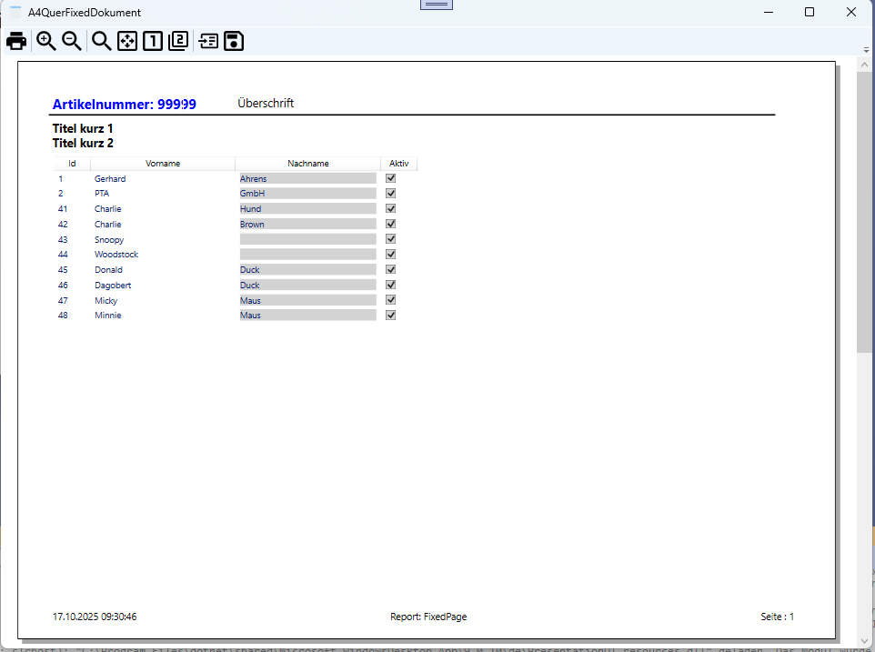
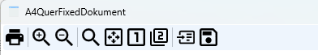

# Reporting mit *DocumentViewer* und *FixedDocument*


## Beschreibung zur Anwendung
Demoprogramm zur Darstellung eines Reports auf Basis von *DocumentViewer* und *FixedDocument*



Die **ReportingLibrary** soll die Erstellung von Berichten auf Basis von *FixedDocument* vereinfachen.
Dazu dienen eine Reihe von Extension Methoden, die das Hinzufügen von Textblöcken, Footer und Bildern erleichtern.

## Das Erstellen eines Berichts erfolgt in drei Schritten:
Erstellen eines **ReportDocument**-Objekts, Hinzufügen von Seiten und schließlich die Anzeige des Berichts in einem **DocumentViewer**.

```csharp
const int PAGEROW = 10;
List<MyItem> demoData = DemoDaten.Create();

FixedDocument document = new FixedDocument();
DocumentPaginator paginator = ((IDocumentPaginatorSource)document).DocumentPaginator;
paginator = new DefaultDocumentPaginator(paginator, paperSize);

int page = (int)Math.Round((demoData.Count / (double)PAGEROW),MidpointRounding.AwayFromZero);
for (int i = 0; i < page; i++)
{
    Range range = new Range(i* PAGEROW, (i+1) * PAGEROW);
    List<MyItem> printSource = demoData.Take(range).ToList();
    if (printSource != null && printSource.Count > 0)
    {
        FixedPage page1 = CreatePage(document, printSource);

        PageContent page1Content = new PageContent();
        ((IAddChild)page1Content).AddChild(page1);
        document.Pages.Add(page1Content);
    }
}

this._fixedDocument = document;
this.rootDoc.Document = document;
```

Seiten erstellen sich aus einem **FixedPage**-Objekt, das mit Hilfe von Extension Methoden mit Inhalt gefüllt wird.
```csharp
private static FixedPage CreatePage(FixedDocument document, List<MyItem> source)
{
    const double TOP = 73;
    const double LEFT = 40;

    string packUri = "pack://application:,,,/ReportingFixedDocument;component/Resources/Picture/ApplicationIcon.png";
    ImageSource imageSource = new ImageSourceConverter().ConvertFromString(packUri) as ImageSource;

    FixedPage resultPage = new FixedPage();
    resultPage.Width = document.DocumentPaginator.PageSize.Width;
    resultPage.Height = document.DocumentPaginator.PageSize.Height;

    resultPage.ReportLabel("Artikelnummer: 99999", Brushes.Blue, 14, FontWeights.Bold, new Thickness(45, 45, 0, 0));
    resultPage.ReportLabel("Überschrift", new Thickness(300, 45, 0, 0));
    resultPage.Image(imageSource, 50,new Thickness(resultPage.Width-100,TOP-50, 0,0));
    resultPage.Line(TOP, LEFT, resultPage.Width-50, 2);
    resultPage.ReportLabel("Titel kurz 1", Brushes.Black, 12, FontWeights.Bold, new Thickness(45, 80, 0, 0));
    resultPage.ReportLabel("Titel kurz 2", Brushes.Black, 12, FontWeights.Bold, new Thickness(45, 100, 0, 0));

    ListView lv = new ListView();
    lv.BorderBrush = Brushes.Black;
    lv.BorderThickness = new Thickness(0);

    GridView gv = new GridView();
    GridViewColumn gvc1 = new GridViewColumn();
    gvc1.Width = 50;
    gvc1.DisplayMemberBinding = new Binding("Id");
    gvc1.Header = "Id";
    gv.Columns.Add(gvc1);

    GridViewColumn gvc2 = new GridViewColumn();
    gvc2.Width = 200;
    gvc2.DisplayMemberBinding = new Binding("Vorname");
    gvc2.Header = "Vorname";
    gv.Columns.Add(gvc2);

    GridViewColumn gvc3 = new GridViewColumn();
    gvc3.Width = 200;
    gvc3.Header = "Nachname";
    gvc3.CellTemplate = GetTextBlockDataTemplate("Nachname");
    gv.Columns.Add(gvc3);

    GridViewColumn gvc4 = new GridViewColumn();
    gvc4.Width = 50;
    gvc4.Header = "Aktiv";
    gvc4.CellTemplate = GetCheckBoxDataTemplate("Aktiv");
    gv.Columns.Add(gvc4);

    lv.View = gv;
    lv.Margin = new Thickness(45, 130, 0, 0);
    lv.ItemsSource = source;

    resultPage.Children.Add(lv);

    resultPage.AddFooterLeft(DateTime.Now.ToString(CultureInfo.CurrentCulture));
    resultPage.AddFooterCenter("Report: FixedPage");
    resultPage.AddFooterRight($"Seite : {document.DocumentPaginator.PageCount + 1}");

    return resultPage;
}
```

Das ganze macht eher einen anachronitischen Eindruck, da es doch gerade bei komplexeren Reports recht aufwendig ist, einen Bericht zu erstellen. Bei einfachen Reports ist der Aufwand verhältnismäßig gering. Zu bedenken gilt aber in jedem Fall, das es aber auch auch eine wenigen Möglichkeit unter NET Core, Berichte zu erstellen, ohne auf externe Bibliotheken zurückgreifen zu müssen.
Allerdings ist diese Möglichkeit sehr flexibel und anpassbar.

So kann auch, die Toolbar des Bereichts Viewer angepasst bzw. erweitert werden.


Im Beispiel sind (am Ende der Toolbar) zwei Buttons hinzugekommen, zum Laden und Speichern eines Berichtes im Microsoft eigenen XPS Format.


# Versionshistorie

- Migration auf NET 10
- Anpassung README.md


